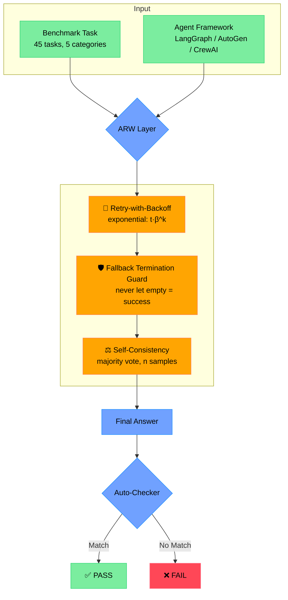
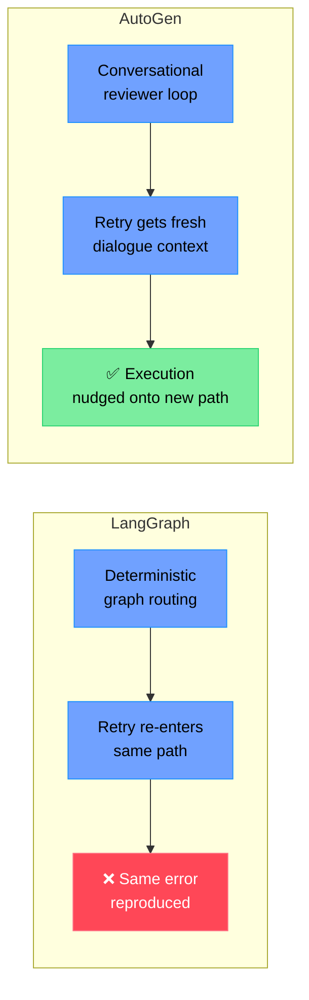

<div align="center">

# ARW — Adaptive Reliability Wrapper
### Diagnosing and Mitigating Reliability Failures in AI Agent Frameworks

*A lightweight, framework-agnostic reliability layer for LangGraph, CrewAI, and AutoGen — and what happens when the same fix doesn't work the same way twice.*

[](.)
[](LICENSE)
[](.)
[](.)

**Authors:** Malaika Arif · Iqra Safdar · Yawar Abbas
Department of Computer Science, COMSATS University Islamabad, Sahiwal Campus

</div>

---

## Table of Contents
- [The Problem](#the-problem)
- [The Benchmark](#the-benchmark)
- [ARW: The Reliability Layer](#arw-the-reliability-layer)
- [Pipeline Overview](#pipeline-overview)
- [Results](#results)
- [Why This Matters: Framework-Dependent Effectiveness](#why-this-matters-framework-dependent-effectiveness)
- [Comparison with AgentTether](#comparison-with-agenttether)
- [Repository Structure](#repository-structure)
- [Reproducing Results](#reproducing-results)
- [Citation](#citation)
- [License](#license)

---

## The Problem

LLM agents fail unpredictably — they hallucinate, misuse tools, terminate silently, or crash on infrastructure errors. Most reliability research either **characterizes** these failures (taxonomies, benchmarks) or **fixes** them within a single framework. Almost nobody asks the obvious follow-up question:

> **Does the same lightweight repair mechanism actually work across different agent frameworks — or does "reliability" mean something different depending on the framework you're wrapping?**

We built a controlled, reproducible benchmark to find out.

## The Benchmark

45 tasks across 5 categories, run identically across all three frameworks using **deterministic fake tools** — no real APIs, no network noise, no rate limits. This isolates whether a failure belongs to the agent or the environment.

| Category | Task IDs | Count | Example |
|---|---|---|---|
| Web Search | t01–t09 | 9 | Find capital |
| File Manipulation | t10–t18 | 9 | Read CSV, average |
| Booking & Transactions | t19–t27 | 9 | Book flight + hotel |
| Math Reasoning | t28–t36 | 9 | Multi-step math |
| Team Coordination | t37–t45 | 9 | Delegate, merge |

Every task is scored by an automated checker — case-insensitive exact match, or substring containment — no human grading, no LLM-as-judge ambiguity.

## ARW: The Reliability Layer

ARW sits **outside** each framework and wraps execution without touching internal control flow. It provides three mechanisms:

| Mechanism | What It Catches | Trigger Rate (Baseline) |
|---|---|---|
| 🔁 **Retry-with-Backoff** | Transient empty/invalid LLM responses | 10.3% of CrewAI runs |
| 🛡️ **Fallback Termination Guard** | Silent execution termination with no output | 5.4% of LangGraph runs |
| ⚖️ **Self-Consistency Verification** *(future work)* | Syntactically valid but semantically wrong answers | Untested — implemented, not yet evaluated |

## Pipeline Overview



## Results

<div align="center">

### Baseline Failure Distribution

| Framework | Wrong Answer | Empty Answer | Infra Crash | Baseline Pass Rate |
|---|---|---|---|---|
| LangGraph | 38.4% | **5.4%** | 0% | 54.4% |
| AutoGen | 43.5% | 0.1% | 0% | 56.4% |
| CrewAI | 23.0% | 0% | **10.3%** | 66.5% |

**Wrong answers dominate everywhere** — the failure signature that ARW's execution-level mechanisms *cannot* fix, since they stem from model-level reasoning, not infrastructure.

### ARW Performance: Before vs. After

| Framework | Baseline | With ARW | Scope | Δ |
|---|---|---|---|---|
| LangGraph | 54.4% | 52.2% | Full (90 runs) | 🔴 −2.2 pp |
| **AutoGen** | 56.4% | **60.0%** | Full (90 runs) | 🟢 **+3.6 pp** |
| CrewAI | 66.5% | 50.0% | Partial (68 runs)* | 🔴 −16.5 pp |

*CrewAI evaluated on 34/45 tasks — team-coordination tasks excluded due to async timeout incompatibility. See [Repository Structure](#repository-structure) for details.

</div>

**Key finding:** ARW is not framework-agnostic in its *effectiveness*, even though it's framework-agnostic in its *design*. AutoGen's conversational, reviewer-loop architecture gives retries a genuine foothold — dialogue history nudges execution onto a different path. LangGraph's deterministic graph routing offers no such flexibility: a retry often re-enters the exact same path and reproduces the exact same error.

## Why This Matters: Framework-Dependent Effectiveness



## Comparison with AgentTether

[AgentTether (Zhao et al., 2026)](https://arxiv.org/abs/2607.06273) is the closest recent work — but it evaluates repair *within a single architecture*. ARW asks a different question: does lightweight repair *transfer* across frameworks?

| Aspect | AgentTether | ARW (Ours) |
|---|---|---|
| Mechanism | CTG + graph-transformer detector + Isolation Forest + analyst LLM + intervention harness | Retry-with-backoff + fallback guard + self-consistency |
| Complexity | Heavy — offline training on 21K trajectories | **Lightweight** — no training, no auxiliary models |
| Model | Qwen3.7-max / GPT-5.4 (commercial API) | **Qwen 2.5 7B, served locally, zero inference cost** |
| Benchmark | τ-bench (261 tasks, 3 domains) | Custom (45 tasks, 5 categories) |
| Frameworks | Single architecture | **LangGraph, AutoGen, CrewAI** |
| Repair rate | 69.11% repair on failed tasks | AutoGen +3.6 pp; LangGraph −2.2 pp; CrewAI 50.0% (partial) |
| Cross-framework? | ❌ Not evaluated | ✅ Explicitly evaluated — efficacy varies |

AgentTether asks *"how much can we repair within one architecture?"* We ask *"does the same lightweight repair work everywhere?"* The answers are complementary — and ours is directly relevant to resource-constrained or on-premises deployments where 7B-scale local models, not commercial frontier APIs, are the reality.

## Repository Structure

```
arw-agent-reliability/
├── README.md
├── LICENSE
├── requirements.txt
│
├── tasks/                   # 45 task definitions + correctness checkers
│   ├── web_search/          # t01–t09
│   ├── file_manipulation/   # t10–t18
│   ├── booking_transactions/ # t19–t27
│   ├── math_reasoning/      # t28–t36
│   └── team_coordination/   # t37–t45
│
├── frameworks/               # Per-framework adapter code
│   ├── langgraph_adapter.py
│   ├── crewai_adapter.py
│   └── autogen_adapter.py
│
├── arw/                       # The reliability layer itself
│   ├── retry_backoff.py
│   ├── fallback_guard.py
│   └── self_consistency.py    # implemented, not yet evaluated
│
├── runner/                    # Orchestrates tasks across frameworks
│   └── run_benchmark.py
│
├── logs/                       # Raw JSON logs of every run
│
├── annotation/                 # Failure taxonomy labeling (11 categories)
│
├── analysis/                   # Metrics, statistics, figure generation
│   ├── failure_distribution.py
│   ├── arw_performance.py
│   └── bootstrap_ci.py
│
└── report/                     # Final written report / paper source
```

## Reproducing Results

```bash
# 1. Clone the repo
git clone https://github.com/malaikaarif/arw-agent-reliability.git
cd arw-agent-reliability

# 2. Install dependencies
pip install -r requirements.txt

# 3. Serve Qwen 2.5 7B locally via Ollama
ollama pull qwen2.5:7b
ollama serve

# 4. Run the full benchmark across all frameworks (baseline)
python runner/run_benchmark.py --mode baseline --frameworks langgraph autogen crewai

# 5. Run with ARW enabled
python runner/run_benchmark.py --mode arw --frameworks langgraph autogen crewai

# 6. Generate figures and tables
python analysis/failure_distribution.py
python analysis/arw_performance.py
```

> **Note:** Baseline runs were collected without a fixed-N protocol (repetition counts vary: 294 LangGraph / 919 AutoGen / 331 CrewAI runs), so raw proportions are reported without significance testing for the baseline corpus. The ARW evaluation uses a controlled paired design with equal repetition (90 runs each for LangGraph/AutoGen, 68 for the partial CrewAI evaluation) — this is what supports the Δ comparisons above.

## Citation

If referencing this work:

```bibtex
@unpublished{arif2026arw,
  title   = {Beyond Accuracy: Diagnosing and Mitigating Reliability Failures in AI Agent Frameworks},
  author  = {Arif, Malaika and Safdar, Iqra and Abbas, Yawar},
  note    = {Under review},
  year    = {2026},
  institution = {COMSATS University Islamabad, Sahiwal Campus}
}
```

## License

MIT License — feel free to use and modify as needed.

---

<div align="center">
<sub>Built at COMSATS University Islamabad, Sahiwal Campus</sub>
</div>
